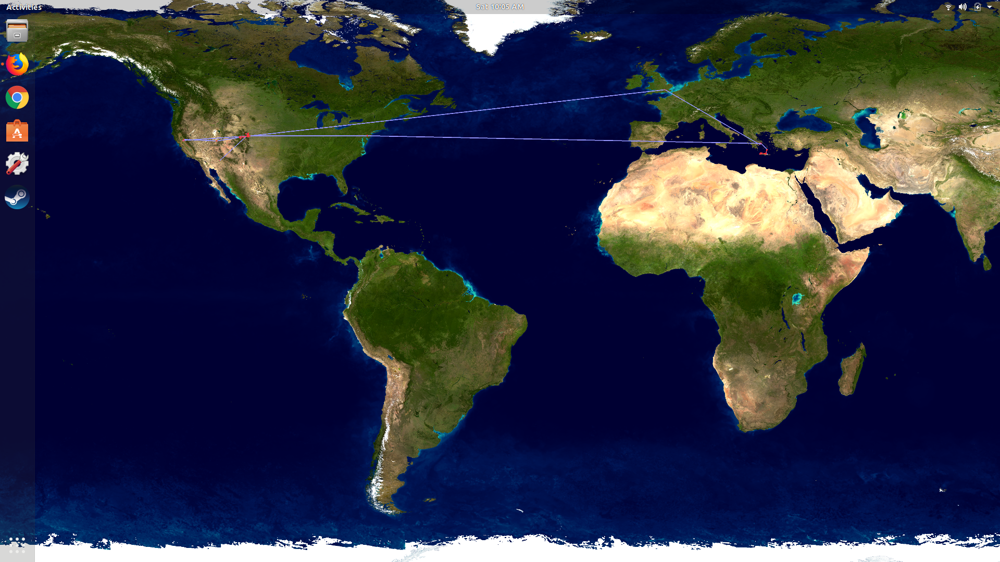

# glocplot: Google Location Plotter

Plot your Google location data on a map for visualization. All processing performed on the executing machine; your data is entirely private to you (and Google, of course...).

### Example result (Download image to view more detail)

### Great for desktop wallpaper, especially after cropping.

## Installation

`go get github.com/asgaines/glocplot`\
`go install github.com/asgaines/glocplot`

## Usage

First, download your data from Google ([google.com/takeout](https://google.com/takeout)). Ensure the `Location History` app is toggled on and `JSON format` is selected. Download and unzip.

Example `glocplot -location ~/Downloads/Takeout/Location\ History/Location\ History.json`

Output will be written to `./glocplot_result.png` in working directory by default.

Arguments
- `-location` *required* Path to file with location history data downloaded from Google Takeout (`Location History.json`)
- `-image` Path to image on which your location data is plotted. A high-res, centered image is provided at `./assets/images/Earth.png`
- `-output` Output location. Defaults to `./glocplot_result.png`
- `-size` Width of points and lines plotted to image. The smaller the width, the more the detail. Default is 1
- `-lines` Whether to display lines connecting location points. Default is true. (`-lines=true`/`-lines=false`)

Open up the image and enjoy!
